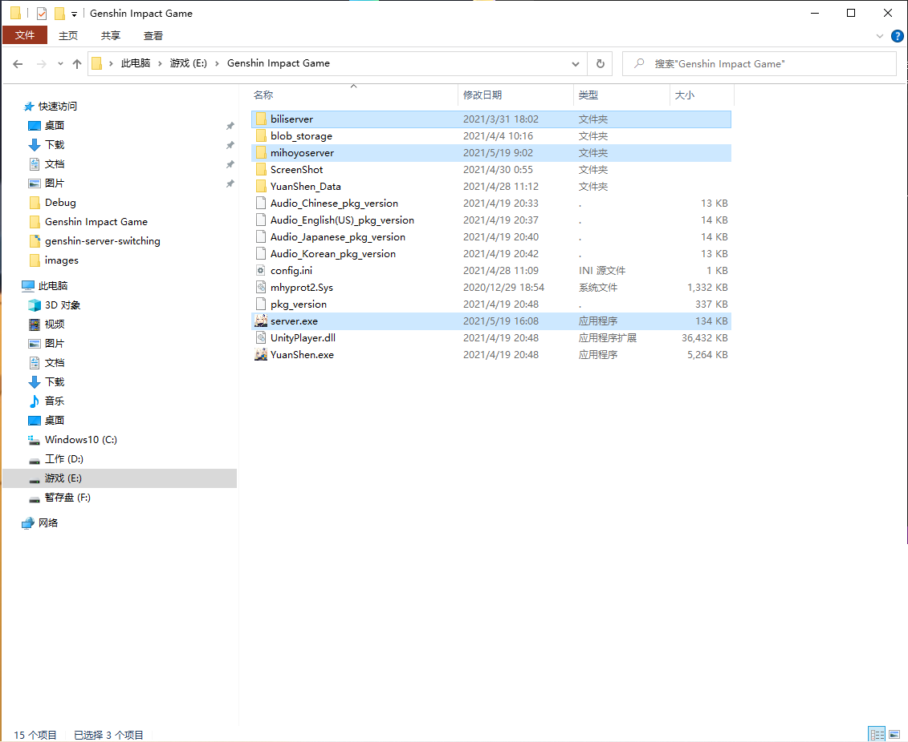

# genshin-server-switching
Windows版原神大陆地区bilibili/官服切换程序

## 如何使用
将编译完成的文件夹里面的文件复制到你的原神文件夹的上一层的目录新建一个文件夹里面，然后就可以使用啦！ 
（路径例子：如果你的原神路径为“E:\Genshin Impact Game”那么转换器的路径是“E:\新建文件夹”其中新建文件夹的名字是可以自定义的） 
（ps：此程序是方便大家移动config.ini文件，然后也检测了使用者的服务器、游戏版本） 
#### 注意
千万别将本项目放在游戏根目录下，进游戏后会告知资源文件错误！
将编译完成的文件夹里面的文件复制到你的原神文件夹，然后就可以使用啦！ 
（ps：此程序更改完服务器后会延迟5秒后打开原神qwq） 
 
然后就直接创建快捷方式到桌面即可！ 
 
（图片来自测试人员截图）
### 实现功能
- [x] 检测版本
- [x] 更换服务器
- [x] 检测路径正确
- [x] 检测两个服务器的配置文件夹是否正确放入对应位置（biliserver与mihoyoserver）
- [x] 判断是否安装原神
- [ ] 图形化界面
### readme统计

 
## 后言
本人为C++新手，可能有些地方代码很杂(特别是获取config.ini判断的那一段)，亦或者不完美，您可以Pull或者Issues建议或者文件，感谢您的帮助！
